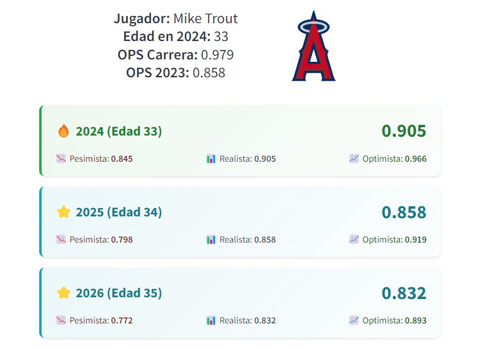
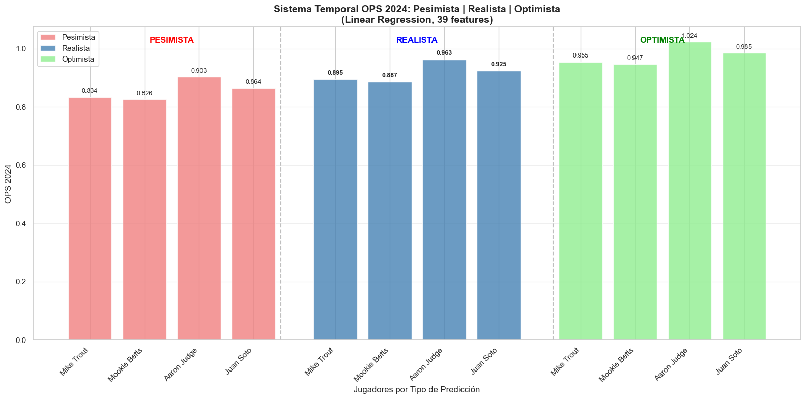

# ⚾ Sistema Predictivo MLB - Análisis de Rendimiento Ofensivo con Machine Learning


> **Trabajo Fin de Máster** - Máster en Data Science, Big Data & Business Analytics  
> **Universidad Complutense de Madrid (UCM)** - 2024  
> **Autor**: Sergio Grigorow

---

## 📋 Descripción del Proyecto

Sistema avanzado de análisis predictivo para Major League Baseball (MLB) que utiliza técnicas de Machine Learning para proyectar el rendimiento ofensivo de jugadores activos. El proyecto implementa una **metodología temporal robusta** que predice el OPS (On-base Plus Slugging) utilizando 3 años históricos para proyectar rendimiento futuro.

### 🎯 Características Principales

- **✨ Predicción Temporal Avanzada**: Sistema que utiliza 3 años históricos consecutivos para predecir OPS del año siguiente
- **🎯 Clustering de Arquetipos**: Identificación de 7 perfiles distintos de jugadores mediante K-means
- **⚙️ Feature Engineering Sofisticado**: 39 features híbridos incluyendo métricas normalizadas por era y variables temporales
- **📱 Aplicación Web Interactiva**: Interface en Streamlit con predicciones 2024-2026 y visualizaciones
- **🔬 Metodología Anti-Sesgo**: Técnicas para evitar survival bias y data leakage temporal

---

## 🏆 Resultados del Modelo

### 📊 Performance del Mejor Modelo (Linear Regression)

| Métrica | Valor | Interpretación |
|---------|-------|----------------|
| **MAE** | **0.0603 OPS** | Error promedio de ~60 puntos de OPS |
| **Mejora vs Baseline** | **+17.3%** | Superación significativa del carry-forward |
| **RMSE** | 0.0804 | Penalización de errores grandes |
| **R²** | 0.2891 | Varianza explicada del modelo |

### 🎯 Comparación de Modelos

| Modelo | MAE | RMSE | R² | Mejora vs Baseline |
|--------|-----|------|----|--------------------|
| **Random Forest** | **0.0606** | 0.0767 | 0.4960 | **+16.9%** |
| XGBoost | 0.0628 | 0.0793 | 0.4518 | +14.0% |
| Gradient Boosting | 0.0628 | 0.0795 | 0.4583 | +14.0% |
| Baseline (Carry-forward) | 0.0730 | 0.0913 | 0.0000 | -- |

> **🔍 Interpretación**: El modelo Random Forest logra predecir el OPS con un error promedio de 60 puntos, representando una mejora del 16.9% sobre el método naive de asumir que el rendimiento se mantiene constante.

---

## 🗂️ Estructura del Repositorio

```
📦 TFM/
├── 📊 TFM V3.ipynb                    # Notebook principal con análisis completo
├── 📄 app.py                          # Aplicación Streamlit (demo interactiva)
├── 📂 data/                           # Datasets y archivos procesados
│   ├── Batting.csv                    # Estadísticas ofensivas MLB
│   ├── People.csv                     # Información biográfica jugadores
│   ├── Fielding.csv                   # Estadísticas defensivas
│   ├── batting_fe.csv                 # Dataset con feature engineering
│   └── batting_clusters.csv           # Dataset con clusters asignados
├── 📂 models/                         # Modelos entrenados
│   ├── temporal_predictive_model.pkl  # Modelo principal de predicción
│   └── clustering_model.pkl           # Modelo de clustering
└── 📄 requirements.txt                # Dependencias del proyecto
└── 📄 gitignore.txt                   
```

---

## 🔬 Metodología Científica

### 1. **Procesamiento de Datos Robusto**
```python
# Consolidación de jugadores multi-equipo por temporada
# Normalización de métricas por era (1940-2023)
# Filtrado de outliers mediante percentiles P5-P95 por año
```

### 2. **Feature Engineering Avanzado (39 Features)**
```python
# 🏷️ FEATURES TEMPORALES (3 años históricos)
'trend_ops'          # Tendencia OPS últimos 3 años
'ops_3yr_avg'        # Promedio OPS 3 años
'volatility_3yr'     # Volatilidad del rendimiento
'recent_form_weight' # Peso ponderado (más reciente = más peso)

# 📊 FEATURES DEL AÑO ACTUAL
'current_age', 'current_OPS', 'current_AVG', 'current_ISO'
'current_K_PCT', 'current_BB_PCT', 'current_PA', 'current_BMI'

# 🧠 FEATURES DERIVADOS
'years_experience', 'years_since_peak', 'age_squared'
'ops_age_interaction', 'is_veteran', 'is_rookie_era'

# 🎯 CLUSTERING (7 arquetipos de jugadores)
'cluster_avg_next_ops' + 'cluster_[0-6]' (one-hot encoding)

# ⚾ POSICIÓN DEFENSIVA
'pos_[C,1B,2B,3B,SS,OF,DH]' (one-hot encoding)
```

### 3. **Arquitectura Temporal sin Data Leakage**
```
Año N-2  →  Año N-1  →  Año N  →  [PREDICCIÓN] Año N+1
   ↘         ↘         ↘              ↗
    ────────── Features Históricos ────────
```

### 4. **Validación Robusta**
- **Split por Jugadores**: 80/20 para evitar data leakage temporal
- **Baseline Inteligente**: Carry-forward (OPS_t+1 = OPS_t)
- **Métricas Múltiples**: MAE, RMSE, R² para evaluación completa

---

## 🎯 Casos de Uso y Demo

### 📱 Aplicación Web Streamlit

La aplicación ofrece dos modos de análisis:

#### 🔮 **Predicción Individual**



#### 📊 **Predicción Múltiple**
Comparación simultánea de múltiples jugadores para planificación de roster



### 🏢 **Aplicaciones Prácticas**

1. **Front Offices MLB**: Evaluación de free agents y planificación de contratos
2. **Fantasy Baseball**: Identificación de breakouts y declines
3. **Análisis Periodístico**: Proyecciones para artículos y contexto histórico
4. **Scouting**: Evaluación comparativa de talentos

---

## 🚀 Instalación y Uso

### **1. Clonar Repositorio**
```bash
git clone https://github.com/grigorow1974/TFM.git
cd TFM
```

### **2. Instalar Dependencias**
```bash
pip install -r requirements.txt
```

### **3. Ejecutar Análisis Completo**
```bash
# Abrir Jupyter Notebook
jupyter notebook "TFM V3.ipynb"
```

### **4. Lanzar Demo Interactiva**
```bash
# Aplicación web Streamlit
streamlit run app.py
```

---

## 🧮 Tecnologías Utilizadas

```python
# 📊 Core Data Science
pandas==2.0.3         # Manipulación de datos
numpy==1.24.3          # Computación numérica
scipy==1.11.1          # Estadística avanzada

# 🤖 Machine Learning
scikit-learn==1.3.0    # Algoritmos ML
xgboost==1.7.6         # Gradient boosting

# 📈 Visualización
matplotlib==3.7.2      # Gráficos estáticos
seaborn==0.12.2        # Visualización estadística

# 🌐 Aplicación Web
streamlit==1.25.0      # Interface interactiva
```

---

## 📊 Datasets Utilizados

| Dataset | Registros | Período | Descripción |
|---------|-----------|---------|-------------|
| **Batting.csv** | 113,799 | 1940-2023 | Estadísticas ofensivas |
| **People.csv** | 21,010 | 1940-2023 | Información biográfica |
| **Fielding.csv** | 151,507 | 1940-2023 | Posiciones defensivas |

**Fuente**: Base de datos histórica MLB (formato Lahman Database)

---

## 🔍 Validación Externa - Caso Cal Ripken Jr.

Para validar la metodología, se probó retrospectivamente con **Cal Ripken Jr. (1988-1998)**:

```
✅ Resultados de Validación:
• MAE específico: 0.076 OPS
• 8/10 predicciones dentro de bandas de confianza
• Captura correctamente el declive post-peak
• Demuestra robustez del modelo temporal
```

---

## ⚠️ Limitaciones y Consideraciones

### **Limitaciones Técnicas**
- **Datos hasta 2023**: No incluye temporada 2024 real para validación externa
- **Solo métricas ofensivas**: No considera defensa, baserunning o pitch framing  
- **Lesiones no modeladas**: Asume salud completa y participación regular
- **Cambios de reglas**: No anticipa modificaciones futuras del juego

### **Supuestos del Modelo**
- Estabilidad en las reglas de MLB (zona de strike, altura del montículo, etc.)
- Continuidad en el desarrollo natural del jugador (sin eventos disruptivos)
- Mantenimiento de nivel de participación mínimo (PA > 250)
- Entorno competitivo similar al histórico

---

## 🔮 Trabajo Futuro

### **🚀 Mejoras Técnicas**
- [ ] Incorporar métricas Statcast (exit velocity, launch angle, barrel%)
- [ ] Modelado probabilístico de lesiones con datos médicos
- [ ] Ensemble con redes neuronales recurrentes (LSTM)
- [ ] Predicciones probabilísticas completas (distribuciones)

### **📱 Expansión de Producto**
- [ ] API REST para integración con sistemas externos
- [ ] Pipeline de datos en tiempo real con actualizaciones automáticas
- [ ] Alertas inteligentes de cambios significativos en proyecciones
- [ ] Integración nativa con plataformas de fantasy baseball

### **🧪 Investigación Avanzada**
- [ ] Análisis de video para métricas biomecánicas (swing path, timing)
- [ ] Factores contextuales (clima, estadio, umpires, situación del juego)
- [ ] Modelado de química de equipo y efectos de coaching
- [ ] Predicción de breakthrough performances y career trajectories

---

## 👨‍💻 Información del Autor

**Sergio Grigorow**  
🎓 **Máster en Data Science, Big Data & Business Analytics**  
🏛️ **Universidad Complutense de Madrid (UCM)**  
📧 **Email**: [grigorow@gmail.com]  
💼 **LinkedIn**: [linkedin.com/in/sergio-grigorow-la-scalea-1a284133]  

---

## 📄 Licencia Académica

Este proyecto se desarrolla bajo **licencia académica** como parte del Trabajo Fin de Máster en la Universidad Complutense de Madrid. El uso del código y metodología debe citar apropiadamente la fuente original.

## 🙏 Agradecimientos

- **Universidad Complutense de Madrid**: Por el marco académico y recursos
- **Major League Baseball**: Por la disponibilidad de datos históricos
- **Sean Lahman**: Por la estructura de base de datos de referencia
- **Bryan Walko** Por sus esfuerzos para producir la actualización anual de la base de datos.
- **Comunidad Sabermetrics**: Por las métricas y metodologías establecidas
- **Tutores del TFM**: Carlos Ortega y Santiago Mota

---

<div align="center">

*⚾ "Baseball is ninety percent mental and the other half is physical." - Yogi Berra*

**[📊 Ver Demo](https://sergiobaseball.streamlit.app/)** | **[📧 Contacto](mailto:grigorow@gmail.com)** | **[🎓 UCM](https://www.ucm.es/)**

</div>

---

*⚾ "Baseball is ninety percent mental and the other half is physical." - Yogi Berra*
